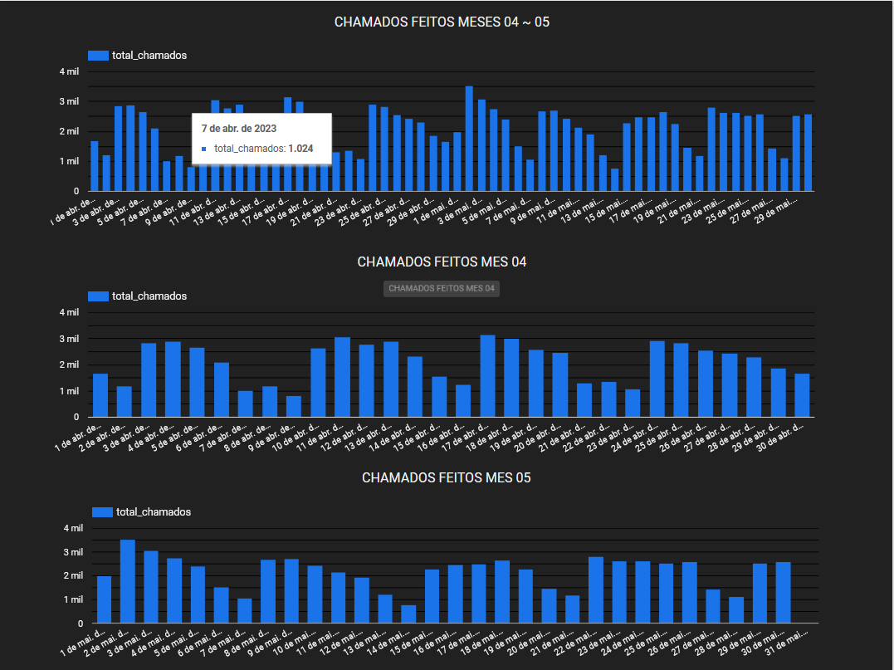
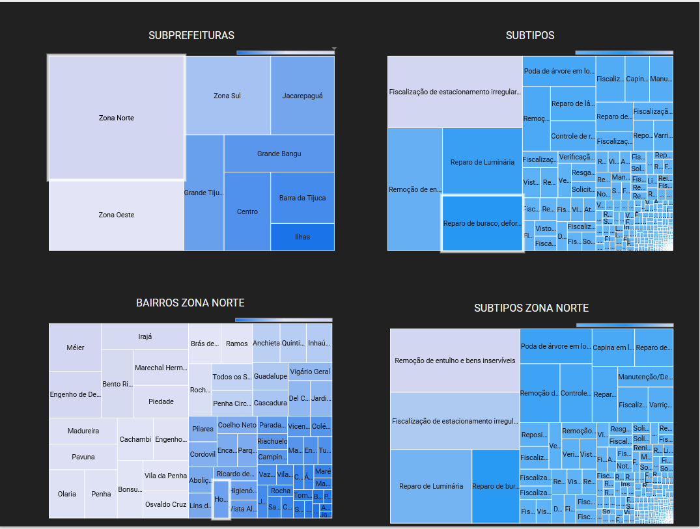
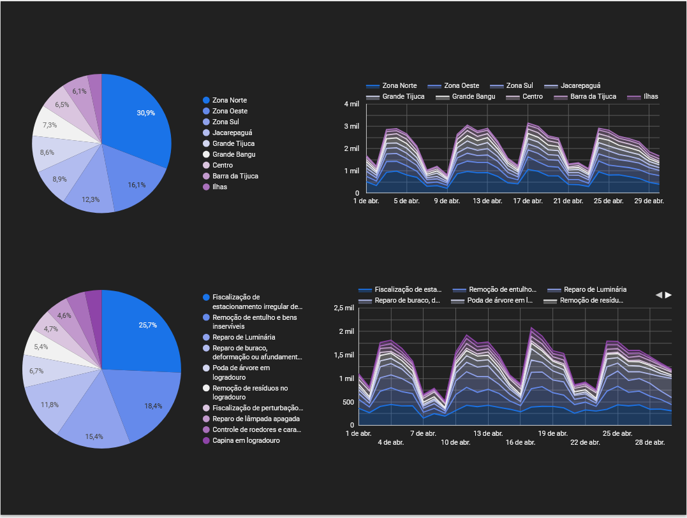
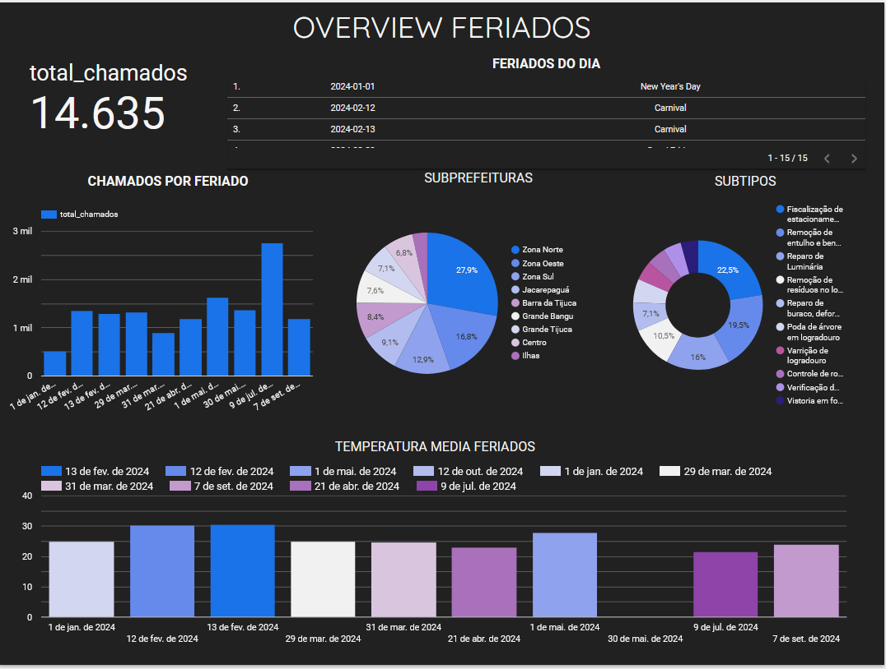

# Desenvolvimento Looker

Processo de desenvolvimento do dashboard no Looker.

## Analisando meses 04/23 e 05/23

A fim de explorar algo de relevante do banco de dados, decidi analisar os meses de abril e maio de 2023. Para isso, fiz uma query que me retornasse a quantidade de chamados por bairro, subprefeitura e subtipo de chamado. 

```sql
SELECT 
    DATE(c.data_inicio) AS data,
    b.subprefeitura,
    c.subtipo,
COUNT(c.id_bairro) AS total_chamados,
	b.nome,
FROM
    `datario.adm_central_atendimento_1746.chamado` c
JOIN 
    `datario.dados_mestres.bairro` b ON c.id_bairro = b.id_bairro
WHERE
    DATE(c.data_inicio) BETWEEN "2023-04-01" AND "2023-05-30"
GROUP BY
    data, b.subprefeitura, c.subtipo, b.nome
ORDER BY 
    data, total_chamados DESC;
```

Primeiro objetivo foi comparar a quantidade de chamados no periodo de cada mês para ver os dias de pico.



### conclusões

- conseguimos identificar que há sim uma tendencia de aumento de chamados em dias especificos

- conseguimos com isso identificar os dias de pico para preparar a equipe para esses dias.

Depois a fim de ver quais as subprefeituras e subtipos mais recorrentes no total dos 2 meses fiz um mapa de arvore para cada mes.

Depois de identifica a subprefeitura com mais chamados, decidi explorar um pouco mais os bairros e os subtipos com mais chamados dessa subprefeitura.



### conclusões 

- pudemos indentificar que zona norte foi a subprefeitura com mais chamados nos meses de abril e maio de 2023.

- pudemos bairros com mais chamados na zona norte e os subtipos mais recorrentes dentro dessa subprefeitura. 

- com isso poderiamos direcionar ações para melhorar a qualidade de vida dos moradores da zona norte. 

- poderiamos fazer previsoes com os dias de pico e o subtipo esperado para esses dias.

Depois para verificar os picos de cada subtipo e bairro, fiz um grafico de pizza e de área para a amostra total. Assim conseguimos ver a representatividade de cada subtipo e bairro nos meses de abril e maio de 2023.



### conclusões

- conseguimos perceber que zona norte e zona oeste concentram quase metade de todos os chamados do periodo. Perguntando ao chatGPT em relação a porcentagem da população carioca que habita na zona norte e oeste, recebemos a seguinte resposta 

```markdown
Aproximadamente 40% a 45% da população do Rio de Janeiro reside na Zona Norte, embora essa estimativa possa variar um pouco dependendo das fontes e da metodologia de cálculo. Essa área é uma das mais populosas e inclui bairros como Tijuca, Méier, Madureira, entre outros, com uma densidade populacional significativa em relação às outras zonas da cidade.
```
  
```markdown
Na Zona Oeste do Rio de Janeiro, cerca de 30% a 35% da população carioca reside, segundo estimativas aproximadas. Essa região abrange bairros populosos como Campo Grande, Bangu, Santa Cruz e Jacarepaguá, que têm visto um crescimento constante nos últimos anos.
```

- entao para retirarmos insights mais fideldignos, seria interessante fazer uma analise de proporção de chamados por bairro e subtipo em relação a população de cada bairro.

## Analisando feriados de 2024

Para essa analise precisei importar os dados referentes aos feriados de 2024. Para isso fiz uma query que me retornasse os feriados de 2024.

```sql
SELECT 
    DATE(c.data_inicio) AS data,
    b.subprefeitura,
    c.subtipo,
    COUNT(c.id_bairro) AS total_chamados,
    b.nome
FROM
    `datario.adm_central_atendimento_1746.chamado` c
JOIN 
    `datario.dados_mestres.bairro` b ON c.id_bairro = b.id_bairro
WHERE
    DATE(c.data_inicio) IN (
        "2024-01-01", 
        "2024-02-12", 
        "2024-02-13", 
        "2024-03-29", 
        "2024-03-31", 
        "2024-04-21", 
        "2024-05-01", 
        "2024-05-30", 
        "2024-07-09", 
        "2024-09-07", 
        "2024-10-12", 
        "2024-11-02", 
        "2024-11-15", 
        "2024-11-20", 
        "2024-12-25"
    )
GROUP BY
    data, b.subprefeitura, c.subtipo, b.nome
ORDER BY 
    data, total_chamados DESC;
```

Precisei tambem importar os dados da api de feriados. Para isso utilizei dentro do looker um conector que conectava diretamente na api pelo url e importava os dados json.

E por fim precisava do dado da temperatura media registrada em cada feriado. Porém a api nao me permitia consultar apenas dias especificos, e trazer a informaçao do ano todo seria muito custoso. Entao decidi escrever um script em python(que se encontra junto as resoluçoes dos outros desafios) que me retornasse a temperatura media de cada feriado e salvasse em um arquivo csv. 

```python
import requests
import csv
from datetime import datetime

datas = [
    "2024-01-01",
    "2024-02-12",
    "2024-02-13",
    "2024-03-29",
    "2024-03-31",
    "2024-04-21",
    "2024-05-01",
    "2024-05-30",
    "2024-07-09",
    "2024-09-07",
    "2024-10-12",
]

latitude = -22.9064
longitude = -43.1822

output_file = "respostas\Python\dados.csv"


# https://archive-api.open-meteo.com/v1/archive?latitude=-22.9064&longitude=-43.1822&start_date=2024-10-14&end_date=2024-10-14&daily=temperature_2m_mean
def fetch_temperature_data(date):
    url = (
        f"https://archive-api.open-meteo.com/v1/archive"
        f"?latitude={latitude}&longitude={longitude}"
        f"&start_date={date}&end_date={date}"
        f"&daily=temperature_2m_mean"
    )
    response = requests.get(url)
    if response.status_code == 200:
        data = response.json()
        return {
            "date": date,
            "temperature_mean": data["daily"]["temperature_2m_mean"],
        }
    else:
        print(f"Erro ao buscar dados para {date}")
        return None


with open(output_file, mode="w", newline="") as file:
    writer = csv.writer(file)
    writer.writerow(["Data", "Temperatura Média"])

    for date in datas:
        result = fetch_temperature_data(date)
        if result:
            temperature_mean = (
                result["temperature_mean"][0]
                if isinstance(result["temperature_mean"], list)
                else result["temperature_mean"]
            )
            writer.writerow([result["date"], temperature_mean])

print(f"Dados salvos em {output_file}")
```

Um simples script que basicamente retornava a temperatura media de todos os feriados de 2024 e salvava no arquivo csv. Com isso consegui importar os dados para o looker e fazer a analise.



Utilizando os dados de feriados, criei uma tabela para melhor informar o nome do feriado da data em questão.
Depois fiz um grafico de barras para mostrar a quantidade de chamados em cada feriado.
Decidi usar graficos de pizza para melhor visualização da representatividade de cada subtipo e subprefeituras nos feriados. Para finalizar trouxe tambem um dado nao muito relevante, mas que poderia ser interessante, a temperatura media de cada feriado.

### conclusões

- pudemos identificar o feriado com mais chamados (Constitutionalist Revolution of 1932)
- pudemos identificar em que subprefeitura os chamados se concentraram. (zona norte e zona oeste novamente)
- pudemos ver a representatividade de cada subtipo nos feriados. (fiscalização de estacionamente, remoção de entulho e reparo de luminaria)
- nao identificamos uma correlação entre a temperatura media e a quantidade de chamados nos feriados.
- poderia fazer a media geral de cada dia dentro do periodo para saber se durante feriados os chamados aumentam ou diminuem. E se subtipos especificos tem mais chamados em feriados.